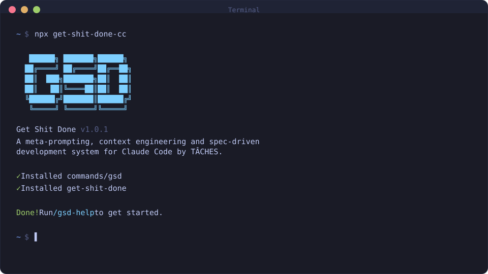

<div align="center">

# GET SHIT DONE (GSD)

[English](README.md) · [Português](README.pt-BR.md) · [日本語](README.ja-JP.md) · [한국어](README.ko-KR.md) · [简体中文](README.zh-CN.md)

**A meta-prompting, context engineering, and spec-driven development system for AI coding agents.**

[](https://github.com/girishlade111/get-shit-done)
[](LICENSE)
[](https://nodejs.org)
[](package.json)

<br>

```bash
npx get-shit-done-cc@latest
```

**Works on macOS, Windows, and Linux.**

<br>



</div>

---

## Table of Contents

- [Overview](#overview)
- [Why GSD](#why-gsd)
- [Installation](#installation)
- [Supported Runtimes](#supported-runtimes)
- [Core Workflow](#core-workflow)
- [Commands](#commands)
- [Multi-Agent Architecture](#multi-agent-architecture)
- [Feature Highlights](#feature-highlights)
- [Configuration](#configuration)
- [Project Structure](#project-structure)
- [Development](#development)
- [Documentation](#documentation)
- [Contributing](#contributing)
- [Security](#security)
- [License](#license)

---

## Overview

**Get Shit Done (GSD)** is a structured development methodology delivered as a set of slash commands, workflow files, agent definitions, and hooks that install directly into your AI coding runtime.

Instead of asking an AI to "build a feature" and hoping for the best, GSD forces a disciplined loop:

```
ideate → research → discuss → plan → verify plan → execute → verify work → ship
```

Every stage produces a durable artifact on disk (`.planning/`), so progress survives context resets, can be reviewed by humans, and can be resumed in a brand-new session.

GSD was built in response to the common failure mode where an AI forgets your project structure after a `/clear`, hallucinates APIs that don't exist, or generates code nobody verified. The fix is **context engineering**: keep the right facts in front of the model at the right time, and gate every transition on a check.

> **Origin:** GSD started as an anti-hallucination measure and evolved into a full spec-driven development system. It is heavily inspired by — and in some places improves upon — BMAD, Spekk, SpecKit, Taskmaster, Jira, and Cursor's plan/apply mode.

---

## Why GSD

| Problem | How GSD addresses it |
|---------|----------------------|
| AI forgets project context after a reset | `.planning/` artifacts are written to disk and reloaded on resume |
| AI guesses at ambiguous requirements | `/gsd-discuss-phase` extracts "gray areas" into explicit decisions before any code is planned |
| Plans are too big for one context window | Plans are split into atomic 2–3 task units, each executed with a fresh window |
| Nobody checks the plan was right | Plan checker runs an 8-dimension verification loop (up to 3 iterations) before execution |
| Nobody checks the code does what was promised | Post-execution verifier checks against phase **goals**, not just task completion |
| Tests don't prove anything | Nyquist validation maps every requirement to a concrete test command before implementation |
| Regressions compound across phases | Cross-phase regression gate re-runs prior phases' suites after each execution |
| Cost spirals on big models | Model profiles (`quality` / `balanced` / `budget` / `inherit`) assign a model tier per agent |
| Vendor lock-in to one AI CLI | Installer targets 13 runtimes with per-runtime content transformation |

---

## Installation

### Quick start

```bash
npx get-shit-done-cc@latest
```

The installer is interactive — it detects installed runtimes, asks which to target, and offers a global or project-local install.

### Non-interactive install

```bash
# Install globally for Claude Code
npx get-shit-done-cc@latest --claude --global

# Uninstall cleanly
npx get-shit-done-cc@latest --uninstall
```

### Requirements

- **Node.js >= 22**
- Git
- An authenticated AI coding runtime (Claude Code, OpenCode, Gemini CLI, etc.)
- `gh` CLI (optional — enables `/gsd-ship` PR creation)

### Verify the install

Start your runtime in a project directory and run:

```
/gsd-help
```

You should see the full GSD command index.

---

## Supported Runtimes

GSD installs into, and adapts its content for, the following runtimes:

| Runtime | Surface | Config file |
|---------|---------|-------------|
| **Claude Code** | Slash commands + agents + hooks | `settings.json` |
| **OpenCode** | Slash commands + `mode: subagent` agents | `opencode.json` / `opencode.jsonc` |
| **Gemini CLI** | Slash commands + agents + `AfterTool` hooks | `settings.json` |
| **Kilo** | Slash commands + `mode: subagent` agents | `kilo.json` / `kilo.jsonc` |
| **Codex** | Skills (TOML) | TOML |
| **GitHub Copilot** | Slash commands + instructions | Instructions |
| **Antigravity** | Skills | Config |
| **Trae** | Skills | Config |
| **Cline** | Rules | `.clinerules` |
| **Augment Code** | Skills | Config |
| **CodeBuddy** | Skills | Config |
| **Qwen Code** | Skills | Config |
| **Windsurf** | Rules | Config |

The installer transforms tool names, file paths, and frontmatter per runtime, so the same workflow behaves natively everywhere.

---

## Core Workflow

### 1. Initialize — `/gsd-new-project`

Adaptive questioning ("dream extraction", not requirements interrogation) → 4 parallel researchers investigate stack, features, architecture, and pitfalls → synthesis → scoped requirements (`v1` / `v2` / out-of-scope) → phased roadmap with requirement traceability.

**Produces:** `PROJECT.md`, `REQUIREMENTS.md`, `ROADMAP.md`, `STATE.md`, `config.json`, and `research/*.md`.

Supports `--auto @file.md` to bootstrap entirely from a document.

### 2. Discuss — `/gsd-discuss-phase [N]`

Identifies decision "gray areas" (visual, API, content, organization), scouts the source tree first so questions are code-aware, and asks only what prior `CONTEXT.md` files have not already answered.

**Produces:** `{phase}-CONTEXT.md` — decisions that eliminate AI guessing downstream.

### 3. Plan — `/gsd-plan-phase [N]`

Spawns a phase researcher, then the planner produces XML task plans (2–3 tasks each) with `read_first`, `acceptance_criteria`, and machine-checkable `verify` commands. The plan checker then loops up to 3 times across 8 dimensions.

**Produces:** `{phase}-RESEARCH.md`, `{phase}-{N}-PLAN.md`, `{phase}-VALIDATION.md`.

```xml
<task type="auto">
  <name>Create login endpoint</name>
  <files>src/app/api/auth/login/route.ts</files>
  <action>Use jose for JWT. Validate credentials. Return httpOnly cookie.</action>
  <verify>curl -X POST localhost:3000/api/auth/login returns 200 + Set-Cookie</verify>
  <done>Valid credentials return cookie, invalid return 401</done>
</task>
```

### 4. Execute — `/gsd-execute-phase <N>`

Groups plans into dependency **waves**, runs independent plans in parallel, gives every executor a fresh 200K context window, and makes one atomic git commit per task.

**Produces:** `{phase}-{N}-SUMMARY.md`, `{phase}-VERIFICATION.md`, git commits.

### 5. Verify — `/gsd-verify-work [N]`

Human acceptance testing: walks you through each deliverable, spawns debug agents to diagnose failures automatically, and produces a UAT report.

**Produces:** `{phase}-UAT.md` plus fix plans.

### 6. Ship — `/gsd-ship [N] [--draft]`

Pushes the branch and opens a GitHub PR with an auto-generated body built from `SUMMARY.md`, `VERIFICATION.md`, and `REQUIREMENTS.md`.

### Milestone loop

`/gsd-audit-milestone` → `/gsd-complete-milestone` → `/gsd-new-milestone` closes out a release and starts the next cycle.

### Skip ahead

- **`/gsd-progress --next`** — auto-detects where you are and runs the next logical step.
- **`/gsd-quick`** — ad-hoc tasks with GSD guarantees but a faster path (`--full`, `--discuss`, `--research` flags compose).
- **`/gsd-autonomous [--from N]`** — runs all remaining phases, pausing only for explicit human decisions.

---

## Commands

67 commands ship out of the box. Full syntax and flags live in [`docs/COMMANDS.md`](docs/COMMANDS.md).

<details>
<summary><b>Core workflow</b> (click to expand)</summary>

| Command | Purpose |
|---------|---------|
| `/gsd-new-project` | Bootstrap a project from idea → research → requirements → roadmap |
| `/gsd-workspace` | Multi-repo workspace setup |
| `/gsd-discuss-phase` | Extract gray-area decisions for a phase |
| `/gsd-ui-phase` | Produce a UI design contract (`UI-SPEC.md`) |
| `/gsd-plan-phase` | Research + generate verified atomic plans |
| `/gsd-plan-review-convergence` | Converge a reviewed plan |
| `/gsd-ultraplan-phase` | Deep/extended planning pass |
| `/gsd-execute-phase` | Wave-based parallel execution of plans |
| `/gsd-verify-work` | User acceptance testing with auto-diagnosis |
| `/gsd-ship` | Push + open PR with generated body |
| `/gsd-ui-review` | 6-pillar retroactive visual audit |
| `/gsd-audit-uat` | Audit UAT coverage |
| `/gsd-audit-milestone` | Verify milestone completeness |
| `/gsd-complete-milestone` | Archive, tag, merge, start next cycle |
| `/gsd-milestone-summary` | Summarize a milestone |
| `/gsd-new-milestone` | Start the next development cycle |

</details>

<details>
<summary><b>Phase &amp; navigation</b></summary>

| Command | Purpose |
|---------|---------|
| `/gsd-phase` | Add / insert / remove phases (`--insert`, `--remove`) |
| `/gsd-validate-phase` | Retroactive Nyquist test-gap audit |
| `/gsd-progress` | Status, `--next` auto-advance, `--do` freeform routing |
| `/gsd-resume-work` | Restore full context from `HANDOFF.json` |
| `/gsd-pause-work` | Save handoff (`--report` for a session report) |
| `/gsd-manager` | Interactive command router |
| `/gsd-help` | Command index |

</details>

<details>
<summary><b>Utility, diagnostics &amp; spiking</b></summary>

| Command | Purpose |
|---------|---------|
| `/gsd-quick` | Ad-hoc task with GSD guarantees |
| `/gsd-autonomous` | Run all remaining phases |
| `/gsd-debug` | Stateful, scientific-method debugging (`--diagnose`) |
| `/gsd-explore` | Free exploration |
| `/gsd-undo` | Safe undo of recent work |
| `/gsd-import` / `/gsd-ingest-docs` | Ingest external PRDs/ADRs/specs |
| `/gsd-add-tests` | Generate tests from UAT + acceptance criteria |
| `/gsd-stats` | Project metrics dashboard |
| `/gsd-profile-user` | Build a developer behavioral profile |
| `/gsd-health [--repair]` | Validate / repair `.planning/` integrity |
| `/gsd-cleanup` | Prune stale artifacts |
| `/gsd-spike` / `/gsd-sketch` | Time-boxed investigation / rough design |
| `/gsd-forensics` | Session forensics |
| `/gsd-extract-learnings` | Persist learnings to the knowledge base |

</details>

<details>
<summary><b>Code quality, security &amp; docs</b></summary>

| Command | Purpose |
|---------|---------|
| `/gsd-code-review [--fix]` | Structured review → optional auto-fix loop |
| `/gsd-audit-fix` | Autonomous audit-to-fix |
| `/gsd-secure-phase` | Verify declared threat mitigations exist in code |
| `/gsd-docs-update` | Generate + fact-check documentation |
| `/gsd-review` | Inline review |
| `/gsd-fast` / `/gsd-spec-phase` | Fast-track paths |
| `/gsd-pr-branch` | Branch management for PRs |

</details>

<details>
<summary><b>Brownfield, AI integration &amp; configuration</b></summary>

| Command | Purpose |
|---------|---------|
| `/gsd-map-codebase` | Parallel mapping of an existing codebase (7 documents) |
| `/gsd-graphify` | Commit-based codebase knowledge graph |
| `/gsd-ai-integration-phase` | Framework selection → `AI-SPEC.md` with eval strategy |
| `/gsd-eval-review` | Audit eval coverage of an AI phase |
| `/gsd-settings` | Interactive settings |
| `/gsd-config` | Programmatic config (`--profile`, branching, models) |
| `/gsd-surface` | Surface/registry management |
| `/gsd-workstreams` | Workstream namespacing |
| `/gsd-update` | Update GSD with changelog preview + local patch reapply |

</details>

<details>
<summary><b>Capture, backlog &amp; namespace meta-skills</b></summary>

| Command | Purpose |
|---------|---------|
| `/gsd-capture` | Zero-friction note capture (`list`, `promote N`, `--global`) |
| `/gsd-review-backlog` | Backlog parking lot |
| `/gsd-thread` | Persistent context threads |
| `/gsd-inbox` | Inbox triage |
| `/gsd-ns-ideate` · `-project` · `-workflow` · `-context` · `-review` · `-manage` | Two-stage namespace meta-skills |

</details>

---

## Multi-Agent Architecture

GSD uses **thin orchestrators + specialized agents**. Workflow files only spawn agents, collect results, and route — each spawned agent gets a **fresh context window**, so no single conversation ever has to hold the whole project.

33 agents ship under [`agents/`](agents):

| Category | Agents |
|----------|--------|
| Researchers (3) | `project-researcher`, `phase-researcher`, `ui-researcher` |
| Analyzers (2) | `assumptions-analyzer`, `advisor-researcher` |
| Synthesizer | `research-synthesizer` |
| Planner / Roadmapper | `planner`, `roadmapper` |
| Executor | `executor` |
| Checkers (3) | `plan-checker`, `integration-checker`, `ui-checker` |
| Verifier | `verifier` |
| Auditors (4) | `nyquist-auditor`, `ui-auditor`, `security-auditor`, `eval-auditor` |
| Mappers (2) | `codebase-mapper`, `pattern-mapper` |
| Debugger | `debugger` + `debug-session-manager` |
| Docs (4) | `doc-writer`, `doc-verifier`, `doc-classifier`, `doc-synthesizer` |
| Profiler | `user-profiler` |
| Code quality (2) | `code-reviewer`, `code-fixer` |
| AI integration (4) | `ai-researcher`, `domain-researcher`, `eval-planner`, `framework-selector` |
| Infra | `intel-updater`, `roadmapper` |

**Principle of least privilege** is enforced per agent: checkers are read-only, researchers get web access, executors get `Edit` but no web, mappers can write analysis docs but never touch source. See [`docs/AGENTS.md`](docs/AGENTS.md) for full role cards.

---

## Feature Highlights

### Context engineering
- **Context window monitor** — statusline usage bar plus injected agent warnings at ≤35% (WARNING) and ≤25% (CRITICAL) remaining, debounced and advisory-only.
- **Session handoff** — `/gsd-pause-work` writes `continue-here.md` + `HANDOFF.json`; `/gsd-resume-work` restores everything after a `/clear`.
- **Context-window-aware prompt thinning** — trims prompts as the window fills.
- **Queryable codebase intel** — `/gsd-map-codebase --query` builds a JSON knowledge base so agents stop re-exploring from scratch.

### Quality gates
- **Nyquist validation** — maps every requirement to a test command before implementation; retroactively fills gaps via `/gsd-validate-phase`.
- **Plan checker** — 8 dimensions: requirement coverage, task atomicity, dependency ordering, file scope, verification commands, context fit, gap detection, Nyquist compliance.
- **Post-execution verifier** — checks goals, not just task completion, including a test-quality audit (disabled tests, circular assertions, weak assertions).
- **Cross-phase regression gate** — re-runs prior suites after each phase.
- **Requirements coverage gate** — planning cannot complete until every phase requirement is in at least one plan.
- **Node repair** — on verification failure: `RETRY`, `DECOMPOSE`, or `PRUNE`, with a configurable budget (default 2).

### Cost & model control
- **Model profiles** — `quality` (Opus-heavy), `balanced` (default), `budget` (Haiku-heavy), `inherit` (defer to runtime — required for non-Anthropic providers).
- **Per-phase-type models** — coarse tuning across `planning`, `discuss`, `research`, `execution`, `verification`, `completion`.
- **Dynamic routing with failure-tier escalation** — bumps a tier on soft failure, capped by `max_escalations`.

### Brownfield support
- **Codebase mapping** — 4 parallel mappers produce `STACK`, `ARCHITECTURE`, `CONVENTIONS`, `CONCERNS`, `STRUCTURE`, `TESTING`, `INTEGRATIONS`.
- **Post-execute drift detection** — compares against `last_mapped_commit` and warns (or auto-remaps scoped subtrees via `--paths`) when structure changes past a threshold.

### Security
- Package legitimacy gate, prompt-injection scanning, secret scanning, read-before-edit guard hook, commit-docs guard hook, and `/gsd-secure-phase` threat-mitigation verification with ASVS level support.

### Everything else
Git integration (3 branching strategies, atomic commits) · worktree isolation · TDD pipeline mode · safe undo · statistics dashboard · note capture & backlog · persistent context threads · developer profiling · issue-driven orchestration · internationalized docs (EN, pt-BR, ja-JP, ko-KR, zh-CN).

Full catalogue: [`docs/FEATURES.md`](docs/FEATURES.md) (140+ documented features).

---

## Configuration

Configuration lives in `.planning/config.json` and can be edited interactively via `/gsd-settings` or programmatically via `/gsd-config`.

```jsonc
{
  "mode": "interactive",              // or "yolo" (auto-approve)
  "granularity": "standard",          // coarse (3-5) | standard (5-8) | fine (8-12) phases
  "model_profile": "balanced",        // quality | balanced | budget | inherit
  "workflow": {
    "research": true,
    "plan_check": true,
    "verifier": true,
    "nyquist_validation": true,
    "ui_phase": true,
    "node_repair": true,
    "node_repair_budget": 2,
    "auto_advance": false,
    "drift_threshold": 3,
    "drift_action": "warn"
  },
  "parallelization": { "enabled": true },
  "git": { "branching_strategy": "none" }  // none | phase | milestone
}
```

Global defaults can be saved to `~/.gsd/defaults.json`.

Full schema: [`docs/CONFIGURATION.md`](docs/CONFIGURATION.md).

---

## Project Structure

```
get-shit-done/
├── bin/                  # CLI entry points (install.js, gsd-sdk.js) + lib/
├── commands/gsd/         # 67 slash-command definitions (markdown + frontmatter)
├── agents/               # 33 agent role cards (gsd-*.md)
├── get-shit-done/        # Workflow content installed into runtimes
│   ├── workflows/        # Orchestrator workflow files
│   ├── contexts/         # Reusable context blocks
│   ├── references/       # Domain reference material
│   ├── templates/        # Artifact templates
│   └── bin/              # Installed-side CLI helpers (gsd-tools)
├── hooks/                # Runtime hooks (statusline, context monitor, update check)
├── scripts/              # Build, lint, test, and release scripts
├── sdk/                  # TypeScript SDK (ESM/NodeNext) + Vitest tests
├── tests/                # Root node:test suites (*.test.cjs)
├── docs/                 # Full documentation set (see below)
├── assets/               # Logos and terminal images
└── .changeset/           # Changeset-based release notes
```

---

## Development

Requires **Node.js >= 22**. Root code is strict-mode CommonJS; the SDK is strict TypeScript (ESM/`NodeNext`).

```bash
npm install            # install root dependencies
npm test               # build SDK, then run root node:test suites
npm run test:coverage  # c8 coverage with a 70% line-coverage gate
npm run build:hooks    # rebuild generated hook artifacts
npm run build:sdk      # install SDK deps and build TypeScript

cd sdk && npm test     # SDK Vitest unit + integration projects
cd sdk && npm run build  # type-check and emit sdk/dist/
```

Run a single root test:

```bash
node --test tests/name.test.cjs
```

Lint gates:

```bash
npm run lint:descriptions   # command/skill description lint
npm run lint:skill-deps     # skill dependency lint
npm run lint:tests          # no-source-in-tests grep
npm run lint:docs           # required-docs check
npm run lint:changeset      # changeset format
```

Before release-facing changes, run the scan scripts in `scripts/`: `secret-scan.sh`, `base64-scan.sh`, `prompt-injection-scan.sh`.

See [`AGENTS.md`](AGENTS.md) and [`CONTRIBUTING.md`](CONTRIBUTING.md) for full contributor conventions.

---

## Documentation

Everything lives under [`docs/`](docs/README.md).

| Document | Audience |
|----------|----------|
| [Documentation Index](docs/README.md) | Everyone — start here |
| [Architecture](docs/ARCHITECTURE.md) | Contributors — system design, agent model, data flow |
| [Command Reference](docs/COMMANDS.md) | Everyone — syntax, flags, examples |
| [Feature Reference](docs/FEATURES.md) | Everyone — all 140+ features with requirements |
| [Configuration Reference](docs/CONFIGURATION.md) | Everyone — full config schema |
| [User Guide](docs/USER-GUIDE.md) | Everyone — walkthroughs and troubleshooting |
| [Agent Reference](docs/AGENTS.md) | Contributors — role cards for all 33 agents |
| [CLI Tools Reference](docs/CLI-TOOLS.md) | Contributors — `gsd-tools` programmatic API |
| [Issue-Driven Orchestration](docs/issue-driven-orchestration.md) | Everyone — drive GSD from GitHub/Linear/Jira |
| [Context Monitor](docs/context-monitor.md) | Everyone — context window hook architecture |
| [Canary Stream](docs/CANARY.md) | Early adopters — `dev` → `@canary` policy |
| [CHANGELOG](CHANGELOG.md) | Everyone — release history |

Translated docs: [`docs/pt-BR/`](docs/pt-BR/README.md) · [`docs/ja-JP/`](docs/ja-JP/README.md) · [`docs/ko-KR/`](docs/ko-KR/README.md) · [`docs/zh-CN/`](docs/zh-CN/README.md)

---

## Contributing

1. Fork and create a feature branch from `main`.
2. Follow the style of the area you're editing (2-space indent, semicolons, `const`/`let`, `node:` imports for root CJS; ESM/`NodeNext` for the SDK).
3. Name tests `*.test.cjs` (root) or `*.test.ts` / `*.integration.test.ts` (SDK). Use `tests/helpers.cjs` for temp projects and CLI execution.
4. Run `npm test` (and `npm run test:coverage` for library changes) before opening a PR.
5. Every PR must link an approved issue with `Closes #123` / `Fixes #123` / `Resolves #123`.
6. Use Conventional Commit prefixes (`fix:`, `feat:`, `ci:`) — e.g. `fix(#2623): resolve parent .planning root detection`.
7. Update `CHANGELOG.md` or docs for user-facing changes.

See [`CONTRIBUTING.md`](CONTRIBUTING.md) and [`docs/contributor-standards.md`](docs/contributor-standards.md) for the full standards.

---

## Security

Do not commit secrets, local config, or generated worktree artifacts. Report vulnerabilities per [`SECURITY.md`](SECURITY.md).

---

## License

[MIT](LICENSE) © 2025 Lex Christopherson

---

<div align="center">

**Upstream project:** [gsd-build/get-shit-done](https://github.com/gsd-build/get-shit-done) · **Active successor:** [open-gsd/gsd-core](https://github.com/open-gsd/gsd-core)

This repository is a mirror maintained at [girishlade111/get-shit-done](https://github.com/girishlade111/get-shit-done).

</div>
